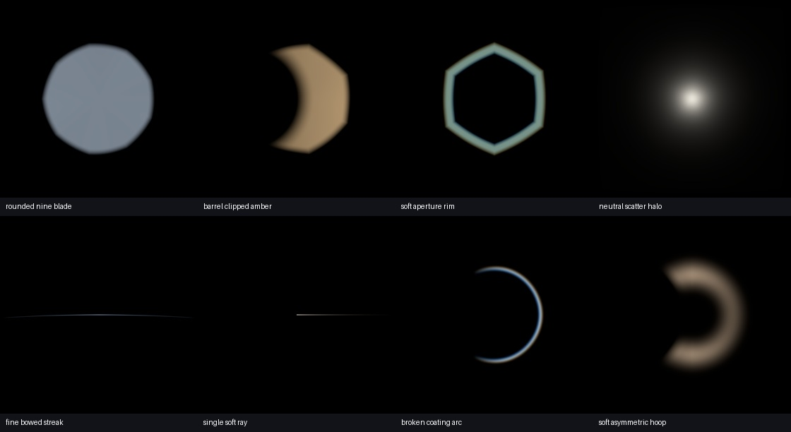
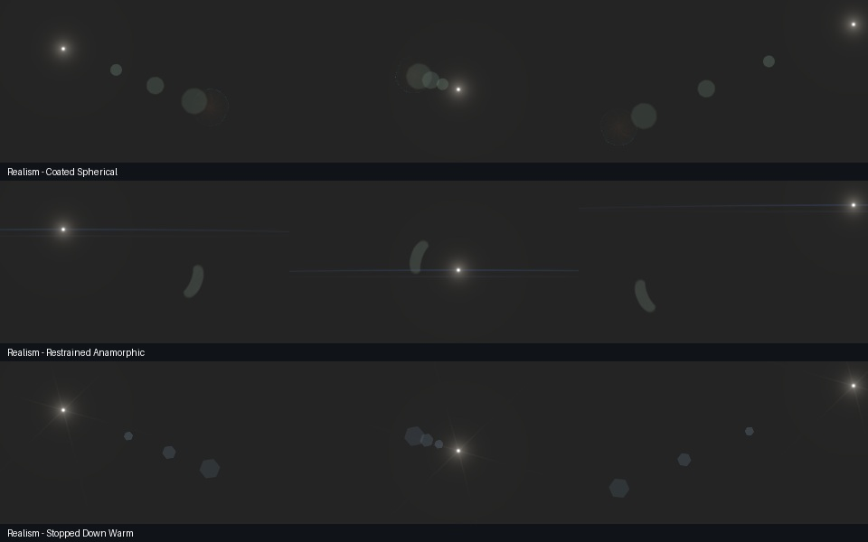

# Realism collection — 2026-09-07

This revision adds nine textures and three restrained looks, fixes one-sided
rays, and adds aperture roundness. It also promotes float16/bfloat16 input
calculations to float32 before casting to the original output type. It keeps
the existing preset filenames and node widget order.

## Finding the collection

Choose **Realism Studies** within Spherical or Anamorphic in the preset menu:

- **Realism - Coated Spherical:** nine-blade rounded ghosts and a subtle
  generated coating reflection.
- **Realism - Restrained Anamorphic:** fine bowed blue streak, faint displaced
  companion, clipped oval ghost.
- **Realism - Stopped Down Warm:** six-ray star and six-blade aperture ghosts.

The element gallery discovers the following PNGs automatically. They are
ordinary library textures, so they also work in existing stacks.

| Family | Filename | Origin / resolution |
|---|---|---|
| ghosts | realism_rounded_nine_blade.png | Procedural, 1024 square |
| ghosts | realism_barrel_clipped_amber.png | Procedural, 1024 square |
| ghosts | realism_soft_aperture_rim.png | Procedural, 1024 square |
| ghosts | realism_coated_aperture.png | Generated, 1254 square |
| glows | realism_neutral_scatter_halo.png | Procedural, 1024 square |
| streaks | realism_fine_bowed_streak.png | Procedural, 1024 square |
| rays | realism_single_soft_ray.png | Procedural, 1024 square |
| rings | realism_broken_coating_arc.png | Procedural, 1024 square |
| hoops | realism_soft_asymmetric_hoop.png | Procedural, 1024 square |

Procedural PNGs are sRGB previews of linear engine renders, feathered at the
border. The procedural versions remain editable through their recipes in
`prompts/realism_recipes.json`; `scripts/build_realism_collection.py` rebuilds
the eight PNGs, three presets and contact sheets. The generated asset is not
overwritten by rebuilding. Exported PNGs are 8-bit LDR, not HDR measurements.

## Controls and compatibility

`params.roundness` on iris and spectral-iris elements ranges from 0 to 1.
Zero preserves the previous polygon outline; one is circular. It changes the
boundary geometry independently of `edge_softness`. It is an approximation
of curved blades, not a lens prescription solver. The editor exposes the
same range and default as Python. Existing presets default to zero.

`glint.points=1` previously rendered two rays. It now emits just the ray
aimed along local +u. An existing one-ray look will visibly change as a
result; use two points if the accidental symmetric version was desired.

Half-precision inputs now use float32 for coordinates, texture sampling,
colorspace conversion and accumulation. Outputs retain their original type;
float64 input retains float64 computation. Final half-precision storage still
limits gradient precision and HDR range. Use float32 for demanding delivery.

## Validation and practical limits

On the portable ComfyUI Python interpreter: **584 tests passed in 34.79 s**.
New regressions cover one-sided ray direction, the circular roundness limit,
invalid roundness values, and exact agreement between half-input rendering
and float32 rendering of the same quantized plate followed by an output cast.
Existing suites cover presets, library references, node contracts and video.
JavaScript passed `node --input-type=module --check`.

The contact sheets were visually inspected at three light positions on a
neutral plate. This is not a validation against photographed lens sweeps or
a live ComfyUI browser test. Performance was not benchmarked. All eight
procedural texture borders are zero. The generated texture's outer border
has a maximum channel value of 1/255; its 0.1-intensity example contributes
at most about 0.0000304 linear per channel at that boundary before other
scaling. If increasing its intensity substantially, use the existing Texture
Prepare node with a small black point and save a separate prepared variant.

For a shot, start with low overall intensity, keep ghost levels below the
source, and use a tracked source and depth occlusion when available. Inspect
both a black plate and the intended shot. Strong spectral color is a
deliberate effect, not a blanket realism improvement. These looks are
original artistic approximations; no lens brand match is claimed.

The full legacy texture library has not been regenerated or photometrically
calibrated. Optical prescription tracing, exposure-calibrated source energy,
highlight-driven bloom/halation and multi-light screen-space dirt remain
future work described in the technical report.

## Generated asset provenance

The **imagegen skill and built-in image generation tool** produced
`elements/ghosts/realism_coated_aperture.png`; no reference photographs or
third-party textures were used. The result was inspected, copied as generated,
and integrated into Coated Spherical. The requested 2048 size was advisory;
the actual file is 1254 by 1254. The final prompt was:

> Use case: photorealistic-natural. Asset type: isolated optical lens-flare texture for additive compositing in a cinema VFX element library. Create a photorealistic laboratory capture of ONE faint defocused aperture reflection: a rounded nine-blade iris ghost, subtle desaturated amber inner fill, very thin pale cyan outer rim with slight coating unevenness, one softly barrel-clipped side, tiny natural radial striations. It must read as transmitted stray light, not a physical glass object. Square image 2048 by 2048 if possible. Single element centered, occupying only the middle 55% of image width and height, with generous perfectly black empty margins on all four sides. Soft optical edges and smooth dim gradients; restrained color, no exaggerated rainbow. No source hotspot, no other ghosts, no scenery, no shadow, no solid object, no typography, no watermark. Black additive-compositing background.

## Research reference

Hullin, Eisemann, Seidel and Lee, [Physically-Based Real-Time Lens Flare
Rendering](https://light.informatik.uni-bonn.de/physically-based-real-time-lens-flare-rendering/),
SIGGRAPH 2011, describes a model incorporating aberrations, coatings and
imperfections. This informed the distinction between an artistic procedural
approximation and an optical simulation; its algorithm was not implemented.

## Activation

After installing these files, restart ComfyUI to load Python changes and
hard-reload the browser (Ctrl+Shift+R) for the new roundness control. No
server restart is performed automatically by this upgrade.
